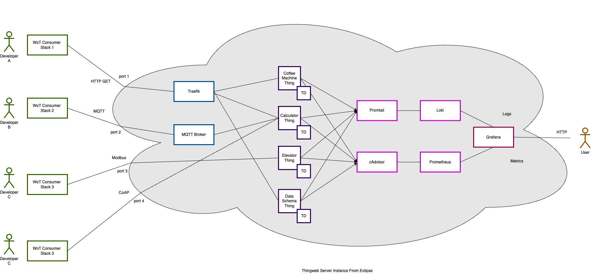

<h1>
  <picture>
  <source media="(prefers-color-scheme: dark)" srcset="https://raw.githubusercontent.com/eclipse-thingweb/thingweb/master/brand/logos/test-things_for_dark_bg.svg">
  <source media="(prefers-color-scheme: light)" srcset="https://raw.githubusercontent.com/eclipse-thingweb/thingweb/master/brand/logos/test-things.svg">
  
</picture>
</h1>

## Test Things

Collection of IoT device simulators that can be used for testing and exploration purposes of different protocols and other Web of Things mechanisms.
The devices are implemented via various programming languages and frameworks.
The protocols you can currently test are:

- HTTP
- CoAP
- MQTT
- Modbus

## How It Works

- External applications—known as WoT Consumer Stacks—connect to the system. Traefik, which handles inbound HTTP requests, or a MQTT broker for real-time, event-based communication allow them to communicate with the internal services ("Things") in two main methods.
- The primary application services, the "Things" (A, B, C, D) reflect several functionalities like those of a Coffee Machine or Elevator. Every service is specified by a Thing Description (TD), a standardized metadata file that explains the service's capabilities and how to interact with it.
- **Monitoring and Observability:** The system is built up comprehensively for monitoring.
  - Promtail collects logs from the services and sends them to Loki, a log aggregation system.
  - cAdvisor analyzes and collects overall metrics from docker containers
  - Prometheus, a time-series database, stores container performance measurements that cAdvisor gathers.
  - Grafana, a central dashboard, shows Loki's logs and Prometheus's metrics to give a whole picture of the system's condition.



## Dependencies

The project has several dependencies. Currently, `JavaScript` and `Python` are used for simulating different devices. Every device has its own dependencies and they should be handled separately. For that reason, `Node.js` is used for JS code, and `poetry` is used for Python code to run the scripts and handle the dependencies.

## Testing

For testing JavaScript Testing Framework `mocha` is used. Therefore, the tests are written in JavaScript.
Every Thing should have its Thing Model and Thing Description validation test.
Thing Model validation test should be put under Thing's main directory and named as `tm.test.json`.
The Thing Description validation test should be put under the protocol and programming language/framework's test directory and named `td.test.json`.
For the Thing Description validation test, the device should boot up and to understand the device booted up without any error, a message `"ThingIsReady"` is expected to be prompted to the console by the device.

## Port Configuration

It is possible to run several Things at the same time in a container, which requires a container to expose that many ports.
Traefik helps with this issue and routes the requests on one exposed port to relevant services inside the container.
Traefik configuration can be seen inside `docker-compose.yml`.
It is not possible to route using a path prefix with UDP, therefore port must be exposed for new Things that use UDP.

## Adding a new Thing

If you are going to add a different protocol for an existing Thing:

1. Create a directory such as `things/<existing_thing>/<your_protocol>/<your_programming_language/your_framework>/`.
2. Create your project files and write your code inside this directory.
3. If you are adding a new programming language, please use a tidy dependency management tool for the programming language. Otherwise use already used tools and frameworks not to overcomplicate the project.
4. Create your `test/` directory under your Thing's directory and add your test files there.

If you are going to add a different programming language/framework for an existing protocol:

1. Create a directory such as `things/<existing_thing>/<existing_protocol>/<your_programming_language/your_framework>/`.
2. Create your project files and write your code inside this directory.
3. Please use a tidy dependency management tool for the programming language/framework. Otherwise use already used tools and frameworks not to overcomplicate the project.

If you are going to add a completely new Thing:

1. Create a directory such as `things/<your_thing_name>/`.
2. Add your Thing Model under the previously created directory and name it such as `<your_thing_name>.tm.json`.
3. Follow the steps above to add your protocol and programming language/framework.

## Current Devices

The table below contains the public base URIs of the Things used for protocol testing.
For HTTP and CoAP Things, the base URL also contains the TD.
Also see [Mashup Things](./mashups/smart-home/README.md), which are useful when combined together and are not necessarily developed for protocol testing.

| Thing Title                                 | Base URI                                                                  |
| ------------------------------------------- | ------------------------------------------------------------------------- |
| http-advanced-coffee-machine                | `http://plugfest.thingweb.io/http-advanced-coffee-machine`                |
| coap-calculator-simple                      |                                                                           |
| coap-calculator-content-negotiation         |                                                                           |
| http-express-calculator-simple              | `http://plugfest.thingweb.io/http-express-calculator-simple`              |
| http-express-calculator-content-negotiation | `http://plugfest.thingweb.io/http-express-calculator-content-negotiation` |
| http-flask-calculator                       | `http://plugfest.thingweb.io/http-flask-calculator`                       |
| mqtt-calculator                             |                                                                           |
| modbus-elevator                             |                                                                           |
| http-data-schema-thing                      | `http://plugfest.thingweb.io/http-data-schema-thing`                      |

### Advanced Coffee Machine

The advanced coffee machine is a device that simulates a behavior of a coffee machine. `allAvailableResources` property consists of the remaining values for its properties `water`, `milk`, `chocolate` and `coffeeBeans`. `possibleDrinks` property holds a list of possible drinks, a user can order, such as espresso, americano, etc. After certain amount of uses of the coffee machine, `maintenanceNeeded` property becomes true and let users know the coffee machine requires a maintenance. `schedules` property stores the users' schedules to brew a coffee at the scheduled time.

### Calculator

The calculator is a simple device, that has a read-only `result` variable, and depending on the action selected by the user, it adds or subtracts user input from the `result`. There is also a read-only `lastChange` variable, which indicates the last time `result` variable has changed. Additionally, the device publishes an event, when `result` is changed.

### Elevator

The elevator is a simple device, that has three variables `lightSwitch`, `floorNumber`, and `onTheMove`. `lightSwitch` is a boolean that represents whether the light on the elevator is turned on or not. `floorNumber` is an integer and represents the floor number of the elevator. `onTheMove` is a boolean and represents whether the elevator is on the move or not.

### Test Thing

The Test Thing is a total toy device that users can try different types of properties and actions.

#### Supported Protocols and Programming Languages

- HTTP
  - TypeScript node-wot
  - JavaScript Express framework
  - Python Flask framework
- CoAP
  - JavaScript
- MQTT
  - JavaScript
- Modbus
  - JavaScript

## Current Mashups

### Smart Home Mashup

See the mashup's [readme](./mashups/smart-home/README.md).

## How to Run

You can either start all the devices at [the same time](#using-docker-compose) or start them [individually](#running-separately).

### Using docker-compose

1. Clone the [infrastructure](https://github.com/eclipse-thingweb/infrastructure) repository
2. Start the infrastructure services via `docker-compose up -f docker-compose-services.yml`
3. Start the Things via `docker-compose up -f docker-compose-things.yml`

After the run, as default, the devices are accessible at:

| Thing Title                                 | Local Access URL                                               |
| ------------------------------------------- | -------------------------------------------------------------- |
| http-advanced-coffee-machine                | `http://localhost/http-advanced-coffee-machine`                |
| coap-calculator-simple                      | `coap://localhost:5683/coap-calculator-simple`                 |
| coap-calculator-content-negotiation         | `coap://localhost:5684/coap-calculator-content-negotiation`    |
| http-express-calculator-simple              | `http://localhost/http-express-calculator-simple`              |
| http-express-calculator-content-negotiation | `http://localhost/http-express-calculator-content-negotiation` |
| http-flask-calculator                       | `http://localhost/http-flask-calculator`                       |
| mqtt-calculator                             | `mqtt://test.mosquitto.org:1883/mqtt-calculator`               |
| modbus-elevator                             | `modbus+tcp://localhost:3179/1`                                |
| http-data-schema-thing                      | `http://localhost/http-data-schema-thing`                      |

For custom configuration, take a look at the `Dockerfile` of each device or `docker-compose-things.yml`.

Docker-compose file uses the images from Docker Hub. If you make any changes in the code build and push the new image with the changes. The command below allows you to create the Docker image for two different platforms you can use (Need permission to be able to push them to the thingweb organization):

```
docker buildx build \
--push \
--platform linux/amd64, linux/arm64 \
--tag thingweb/<IMAGE_NAME> \
--filename <DOCKERFILE_NAME> \
<BUILD_CONTEXT>
```

### Running separately

For running the things separately, using their `Dockerfile`'s, `docker build -t <image-tag> -f ./Dockerfile ../../` command must be used to give the context to be able to copy `tm.json` into the container.

For Node.js-based devices, we use npm workspaces and running `npm install` at the root directory installs all the packages needed for every device. After packages are installed, running `node main.js` would run the thing. For port configuration, running either `node main.js -p 1000` or `node main.js --port 1000` would start the thing on port 1000.
